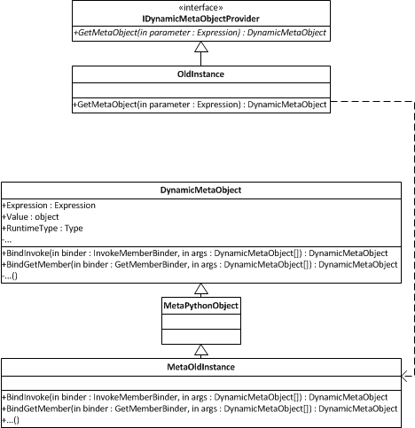

# The Dynamic Language Runtime & the Iron Languages
**Jeff Hardy**

## Introduction
The Iron languages are an informal group of language implementations with "Iron" in their names, in honour of the first one, IronPython. All of these languages have one thing in common - they are dynamic languages running on the Common Language Runtime (CLR), which is more commonly known as the .NET Framework. [The .NET Framework is Microsoft's implementation; there is also the open-source Mono implementation. CLR is the generic term.] The Dynamic Language Runtime is a set of libraries for the CLR that provide much better support for dynamic languages on the CLR.

Architecturally, IronPython, IronRuby, and the DLR are both simple and devilishly complex - from a high level, the designs are similar to many other language implementations, with parsers and compilers and code generators. However, look a little closer and the interesting details begin to emerge - call sites, binders, adaptive compilation, and other techniques are used to make dynamic languages perform nearly as fast as static languages on a platform that was designed for static languages. 

## History
The history of the Iron languages begins in 2003. Jim Hugunin had already written an implementation of Python, called Jython, for the Java Virtual Machine (JVM). At the time, the then-new .NET Framework Common Language Runtime (CLR) was considered by some (exactly who, I'm not sure) to be poorly suited for implementing dynamic languages such as Python. Having already implemented Python on the JVM, Jim was curious has to how Microsoft could have made .NET so much worse than Java:

> "I wanted to understand how Microsoft could have screwed up so badly that the CLR was a worse platform for dynamic languages than the JVM.  My plan was to take a couple of weeks to build a prototype implementation of Python on the CLR and then to use that work to write a short pithy article called, "Why the CLR is a terrible platform for dynamic languages".  My plans quickly changed as I worked on the prototype, because I found that Python could run extremely well on the CLR – in many cases noticeably faster than the C-based implementation.  For the standard pystone benchmark, IronPython on the CLR was about 1.7x faster than the C-based implementation." -- Jim Huginin, http://blogs.msdn.com/b/hugunin/archive/2006/09/05/741605.aspx

[aside: The "Iron" part of the name was a play on the name of Jim's company at the time, "Want of a Nail Software".]

Shortly afterwards, Jim was hired by Microsoft to make .NET an even better platform for dynamic languages; the biggest changes would come in .NET 4 with the introduction of the Dynamic Language Runtime (DLR), of which Jim was the lead architect. The DLR was designed to provide a common core for implementing dynamic languages for .NET.

At the same time as the DLR was announced (April of 2007), Microsoft also announced that in addition to a new version of IronPython that used the DLR, they would also be developing IronRuby on top of the DLR to demonstrate it's adaptability to multiple languages. [In October or 2011, Microsoft stopped developing IronPython and IronRuby and they became independent open-source projects.] The DLR would also be a major part of C# and Visual Basic, with a new keyword (`dynamic`) that allowed those languages to easily call into any language implemented on the DLR. The CLR was already a good platform for implementing static languages, and the DLR makes dynamic languages a first-class citizen.

## Dynamic Language Runtime Principles
The CLR is designed with statically-typed languages in mind; the knowledge of types is baked very deeply into the runtime, and one of its key assumptions is that those types do not change - that a variable never changes its type, or that a type never has any fields or members added or removed while the program is running. This is fine for languages like C# or Java, but dynamic languages, by definition, do not follow those rules.

The heart of the DLR is a standard way of implementing *dynamic objects* while still allowing an objects' behaviour to be customized for a particular language by using *binders*. The DLR also includes a fairly complex mechanism known as *call-site caching* for ensuring that dynamic operations are as fast as possible, and set of classes for building *expression trees*, which allow code to be stored as data and easily manipulated.

The CLR does provide several features that are useful to dynamic languages, including a sophisticated garbage collector; a Just-in-Time (JIT) compiler that converts Common Intermediate Language (IL) bytecode, which is what .NET compilers output, into machine code at runtime; a common static type system, which allows static languages to interoperate seamlessly, and allows dynamic to call objects written in any static language; and finally, dynamic methods (also known as lightweight code generation) that allow code to be generated at runtime with only sightly more overhead than a static method call. [The JVM acquired a similar mechanism with `invokedynamic` in Java 7.] The result of the DLR design is that languages like IronPython and IronRuby can call each other's objects (and those of any other DLR language), because they have a common dynamic object model. Support for this object model was also added to C# 4 (with the `dynamic` keyword) and Visual Basic 10 (in addition to VB's existing method of "late binding") so that they can perform dynamic calls on objects as well. The DLR thus makes dynamic languages first-class citizens on .NET.

## Language Implementation Details
Every language implementation has two basic stages - *parsing* (the frontend) and *code generation* (the backend). In the DLR, each language implements its own frontend, which contains the language parser and syntax tree generator; the DLR provides a common backend that takes expression trees to produce Intermediate Language (IL) for the CLR to consume; the CLR will pass the IL to a Just-In-Time (JIT) compiler, which produces machine code to run on the processor.

There are a few different way to implement the key pieces of a language frontend, and while IronPython and IronRuby are very similar (they were developed side-by-side, after all) they differ in a few key areas. Both IronPython and IronRuby have fairly standard parser designs - both use a *tokenizer* (also known as a *lexer*) to split the text into tokens, and then the *parser* turns those tokens into an *abstract syntax tree* that represents the program. However, the languages have completely different implementations of these pieces.

## Parsing
IronPython's tokenizer is in the `IronPython.Compiler.Tokenizer` class and the parser is in the `IronPython.Compiler.Parser` class. The tokenizer is a hand-written state machine that recognizes Python keywords, operators, and names and produces the corresponding tokens. Each token also carries with it any additional information (such as the value of a constant or name), as well as where in the source the token was found to aid in debugging. The parser then takes this set of tokens and compares them to the Python grammar to see if it matches legal Python constructs.

IronPython's parser is an LL(1) *recursive descent parser*. The parser will look at the incoming token and call a function if the token is allowed and return an error if it is not. A recursive descent parser is built from a set of mutually recursive functions; these functions ultimately implement a state machine, with each new token triggering a state transition. Like the tokenizer, IronPython's parser is written by hand.

IronRuby, on the other hand, has a tokenizer and parser generated by the Gardens Point Parser Generator (GPPG). The parser is is described in the `Parser.y` file, which is a `yacc`-format file that describes the grammar of IronRuby at a high level using *rules* that describe the grammar. GPPG then takes `Parser.y` and creates the actual parser functions and tables; the result is a *table-based* LALR(1) parser. The generated tables are long arrays of integers, where each integer represents a state; based on the current state and the current token, the tables determine which state should be transitioned to next. While IronPython's recursive descent parser is quite easy to read, IronRuby`s generated parser is not. The transition table is enormous (540 distinct states and over 45,000 transitions) and it is next to impossible to modify it by hand.

Ultimately, this is an engineering tradeoff - IronPython's parser is simple enough to modify by hand, but complex enough that it obscures the structure of the language. The IronRuby parser, on the other hand, makes it much easier to understand the structure of the language in the Parser.y file, but it is now dependent on a third-party tool that uses a custom (albeit well-known) domain-specific language and may have its own bugs or quirks. There is no clear winner in the debate over hand-written vs. generated parsers, and the argument will probably continue until the end of time.

What is clear, however, is how important state machines are to parsing, at every phase. For any parsing task, no matter how simple, a state machine is always the right answer.

The output of the parser for either language is an abstract syntax tree. This describes the structure of the program at a high level, with each node mapping directly to a language construct - a statement or expression.  These trees can be manipulated at runtime, often to make optimizations to the program before compilation. However, a language's AST is tied to the language; the DLR needs to operate on trees that do not contain any language specific constructs, only general ones.

## Expression Trees
An *expression tree* is also a representation of a program that can be manipulated at runtime, but in a lower-level, language-independent form. In .NET, the node types are in the `System.Linq.Expressions` namespace, and all of the node types are derived from the abstract `Expression` class. These expression trees cover more than just expressions, however, as there are nodes types for `if` statements, `try` blocks, and loops as well; in some languages (Ruby, for one) these are expressions and not statements.

There are nodes to cover almost every feature a programming language could want. However, they tend to be defined at a fairly low level - instead of having `ForExpression`, `WhileExpression`, etc. there is a single `LoopExpression` which, when combined with a `GotoExpression`, can describe any type of loop. To describe a language at a higher level, languages can define their own node types by deriving from `Expression` and overriding the `Reduce()` method, which returns another expression tree. In IronPython, the parse tree is also a DLR expression tree, but it contains many custom nodes that the DLR would not normally understand (such as `ForStatement`). These custom nodes can be reduced to expression trees that the DLR does understand (such as a combination of `LoopExpression`s and `GotoExpression`s). A custom expression node can reduce to other custom expression nodes, so the reduction proceeds recursively until only the intrinsic DLR nodes remain. One key difference between IronPython and IronRuby is that while IronPython's AST is also an expression tree, IronRuby's is not. Instead, IronRuby's AST is transformed into an expression tree before moving onto the next stage. It's arguable whether having the AST also be an expression tree is actually useful, so IronRuby did not implement it that way.

Each node type knows how to reduce itself, and it can usually only be reduced in one way. For transformations that come from code outside the tree -- optimizations such as constant folding, for example, or IronPython's implementation of Python generators -- a subclass of the `ExpressionVisitor` class is used. `ExpressionVisitor` has a `Visit()` method that calls the `Accept()` method on `Expression`, and subclasses of `Expression` override `Accept()` tocall a specific `Visit()` method on `ExpressionVisitor`, such as `VisitBinary()`. This is a textbook implementation of the *Visitor pattern* from Gamma et al. - there's a fixed set of node types to visit, and an infinite number of operations that could be performed upon them. When the expression visitor visits a node, it usually recursively visits its children as well, and its children, and so on down the tree. However, an `ExpressionVisitor` can't actually modify the expression tree it is visiting, because expression trees are immutable. If the expression visitor needs to modify a node (such removing children), it must produce a new node that replaces the old one instead.

Once an expression tree has been created, reduced, and visited, it ultimately needs to be executed. While expression trees can be compiled directly to IL code, IronPython and IronRuby pass them to an interpreter first, because compiling directly to IL is expensive for code that may only be executed a handful of times.

## Interpreting & Compilation
One of the downsides to using a JIT compiler like .NET does is that it imposes a time penalty when starting up because it takes time to convert the IL bytecode into machine code that the processor can run. JIT compilation makes the code much faster while running than using an interpreter, but the initial cost can be prohibitive, depending on what is being done. For example, a long-lived server process such as a web application will benefit from the JIT because the startup time is mostly irrelevant but the per-request time is critical, and it tends to run the same code repeatedly. On the other hand, a program that is run often but only for short periods of time (such as the Mercurial command-line client) would be better off with a short startup time because it likely only runs each chunk of code once and the fact that the JIT'd code is faster doesn't overcome the fact that it takes longer to start running.

.NET can't execute IL code directly; it always gets JIT compiled into machine code, and this takes time. In particular, program startup times are one of the weak spots of the .NET Framework because much of the code needs to be JIT compiled. While there are ways to avoid the JIT penalty in static .NET programs [Native Image Generation, or NGEN - http://msdn.microsoft.com/en-us/library/6t9t5wcf.aspx], they don't work for dynamic programs. Rather than always compile directly to IL, IronRuby and IronPython will use their own interpreter (found in `Microsoft.Scripting.Interpreter`) that isn't as fast as JIT-compiled code but takes much less time to get started. The interpreter is also useful in situations where dynamic code generation is not allowed, such as on mobile platforms; otherwise the DLR languages would not be able to run at all.

Before execution, the entire expression tree must be wrapped in a function so that it can be executed. In the DLR, functions are represented as `LambdaExpression` nodes. While in most languages a lambda is an anonymous function, the DLR has no concept of names; all functions are anonymous. The `LambdaExpression` is unique in that it is the only node type that can be converted to a *delegate*, which is what .NET calls first-class functions, using its `Compile()` method. A delegate is similar to a C function pointer - it is simply a handle to a piece of code that can be called.

Initially, the expression tree is wrapped in a `LightLambdaExpression`, which can also produce a delegate that can be executed, but rather than generate IL code (which would then invoke the JIT), it instead compiles the expression tree to a list of instructions that are then executed on the interpreter's simple VM. The interpreter is a simple stack-based one; instructions pop values off of the stack, perform an operation, and then push the result back on the stack. Each instruction is an instance of a class derived from `Microsoft.Scripting.Interpreter.Instruction` such as `AddInstruction` or `BranchTrueInstruction` that has properties describing how many items it takes off of the stack and how many it will put o,n and a `Run()` method that actually executes by popping and pushing values on the stack and returning the offset of the next instruction. The interpreter takes the list of instructions and executes them one by one, jumping forward or backwards depending on the return value of the `Run()` method.

Once a a piece of code has been executed a certain number of times, it will be converted to a full `LambdaExpression` by calling `LightLambdaExpression.Reduce()`, compiled to a `DynamicMethod` delegate (on a background thread for a bit of parallelism), and the old delegate call site will be replaced with the newer, faster one. This greatly reduces the cost of executing functions that may only be called a few times, such as the main function of a program, while making commonly-called function fun as fast as possible. By default, the compilation threshold is set at 32 executions, but this can be changed with a command-line option or by the host program, including disabling either compilation or the interpreter entirely. << why that number? >>

Whether running through the interpreter or compiled to IL, the language's operations are not hardcoded by the expression tree compiler. Instead, the compiler generates call sites for each operation that may be dynamic (which is nearly all of them). These call sites give the objects a chance to implement dynamic behaviour while still keeping performance high.

## Dynamic Call Sites
In a static .NET language, all of the decisions about what code should be called are made at compile time. For example, consider the following line of C#:

     var z = x + y;

The compiler knows what the types of 'x' and 'y' are and whether or not they can be added. The compiler can emit the proper code for handling overloaded operators, type conversions, or whatever else might be needed to make the code run properly, based solely on the static information it knows about the types involved. Now, consider the following line of Python code:

     z = x + y

The IronPython compiler has *no idea* what this might do when it encounters it, because it doesn't know what the types of `x` and `y` are [in principle it could, but neither IronPython nor IronRuby do type inference], and even if it did know, the ability of `x` and `y` to be added could change at runtime anyway. Instead of emitting the IL code for adding numbers, the IronPython emits a *call site* that will be resolved at runtime.

A call site is a placeholder for an operation to be determined at runtime; they are implemented as instances of the `System.Runtime.CompilerServices.CallSite` class. In a dynamic language like Ruby or Python, just about every operation has a dynamic component; these dynamic operations are represented in the expression trees as `DynamicExpression` nodes, which the expression tree compiler knows to convert to a call site. When a call site is created, it is does not yet know how to perform the desired operation; however, it is created with an instance of the proper *call site binder* that is specific to the language in use, and contains all of the necessary information about how to perform the operation.

Each language will have a different call site binder for each operation, and the binders often know many different ways to perform an operation depending on the arguments given to the call site. However, generating these rules is expensive (in particular, compiling them to a delegate for execution, which involves invoking the .NET JIT), so the call site has a multi-level *call site cache* that stores the rules that have already been created for later use.

The first level, L0, is the `CallSite.Target` property on the call site instance itself. This stores the most-recently-used rule for this call site; for a vast number of call sites, this is all that will ever be needed as they are only ever called with one set of argument types. The call site also has another cache, L1, that stores a further 10 rules. If `Target` is not valid for this call (for example, if the arguments types are different), the call site first checks its rules cache to see if it has already created the proper delegate from a previous call, and reuses that rule instead of creating a new one.

Storing rules in the cache is driven by the time it takes to actually compile a new rule compared to the time it takes to check the existing rules. Roughly speaking, it takes about 10 ns for .NET to execute a type check on a variable (checking a binary function takes 20 ns, etc.), which is the most common type of rule predicate. Compiling a simple method to add doubles, on the other hand, takes about 80 µs, or three orders of magnitude longer. The size of the caches is limited to prevent wasting memory storing every rule that gets used at a call site; for a simple addition, each variation requires about 1 kB of memory. However, profiling showed that very few call sites ever had more than 10 variations.

Finally, there is the L2 cache, which is stored on the binder instance itself. The binder instance that is associated with a call site may store some extra information with it that makes it specific to a call site, but a large number of call sites aren't unique in any way and can share the same binder instance. For example, in Python, the basic rules for addition are the same throughout the program; it depends on the two types on the either side of the `+`, and that's it. All of the addition operations in the program can share the same binder, and if both the L0 and L1 caches miss, the L2 cache contains a much larger number of recent rules (128) collected from across the entire program. Even if a call site is on its first execution, there's a good chance it might already find an appropriate rule in the L2 cache. To ensure that this works most effectively, IronPython and IronRuby both have a set of canonical binder instances that are used for common operations like addition.

If the L2 cache misses, the binder is asked to create a *implementation* for the call site, taking into account the types (and possibly even the values) of the arguments. In the above example, if `x` and `y` are doubles (or another native type), then the implementation simply casts them to doubles and calls the IL `add` instruction. The binder also produces a test that checks the arguments and ensures they are valid for the implementation. Together, the implementation and the test make a rule. In most cases, both the implementation and the test are created and stored as expression trees. [The call site infrastructure does not depend on expression trees, however; it can be used with delegates alone.]

If the expression trees were expressed in C#, the code would be similar to:

     if(x is double && y is double) {		// check for doubles
          return (double)x + (double)y;	// execute if doubles
     }
     return site.Update(site, x, y);		// not doubles, so find/create another rule for these types

The binder then produces a *delegate* from the expression trees, which means the rule is compiled to IL and then to machine code. In the case of adding two numbers, this will likely become a quick type check and then a machine instruction to add the numbers. Even with all of the machinery involved, the ultimate end result is only marginally slower than static code. IronPython also includes a bunch of precompiled rules for common operations like addition of primitive types, which saves time because they don't have to be created at runtime.

## Meta-Object Protocol
Besides the language infrastructure, the other key part of the DLR is the ability for a language (the *host language*) to make dynamic calls on objects defined in another language (the *source language*). To make this possible, the DLR must be able to understand what operations are valid on an object, no matter the language it was written in. Python and Ruby have fairly similar object models, but JavaScript has a radically different prototype-based (as opposed class-based) type system. Instead of trying to unify the various type systems, the DLR treats them all as if they were based on Smalltalk-style *message passing*. In a message-passing object-oriented system, objects send messages to other objects (with parameters, usually), and the object can return another object as a result. Thus, while each language has its own idea of what an object is, they can almost all be made equivalent by viewing method calls as messages that are sent between objects. Of course, even static OO languages fit this model; what makes dynamic languages unique is that the objects usually have the chance to intercept the message and process it differently if necessary.

The DLR defines the following messages:

*  `{Get|Set|Delete}Member` - operations for manipulating an object's members
*  `{Get|Set|Delete}Index` - operations for indexed objects (such as arrays or dictionaries)
*  `Invoke`, `InvokeMember` - invoke an object or member of an object
*  `CreateInstance` - create an instance of an object
*  `Convert` - convert an object from one type to another
*  `UnaryOperation`, `BinaryOperation` - perform operator-based operations, such as negate (`!`) or add (`+`)

Taken together, these operations should be sufficient for implementing just about any language's object model.

Because the CLR is inherently statically-typed, dynamic language objects must still be represented by static classes. The usual technique is to have a static class such as `PythonObject` and have the actual Python objects be instances of this class or its subclasses. For reasons of interoperability and performance, the DLR's mechanism is a lot more complicated. Instead of dealing with language-specific objects the DLR deals with *meta-objects*, which are subclasses of `System.Dynamic.DynamicMetaObject` and have methods for handling all of the above messages. Each language has its own subclasses of `DynamicMetaObject` that implement the language's object model, such as IronPython's `MetaPythonObject`. The meta classes also have corresponding concrete classes that implement the `System.Dynamic.IDynamicMetaObjectProtocol` interface, which is how the DLR identifies dynamic objects. 

From a class that implements `IDynamicMetaObjectProtocol`, the DLR can get a `DynamicMetaObject` by calling `GetMetaObject()`. This `DynamicMetaObject` is provided by the language and implements the binding functions as required by that object. Each `DynamicMetaObject` also has the value and type, if available, of the underlying object. Finally, a `DynamicMetaObject` stores an expression tree representing the call site so far and any restrictions on that expression, similar to the call site binders. 

When the DLR is compiling a call to a method on an IronPython function, it first creates a call site (i.e. an instance of the CallSite class). The call site initiates the binding process as described above, which results in it eventually calling `GetMetaObject()` (on an instance of `PythonFunction` in this case). This returns an instance of `MetaPythonFunction`, which is a subclass of `DynamicMetaObject` through `MetaPythonObject`; its value is the `PythonFunction` instance it was created from, and its expression tree is a placeholder for the value. Next, a binder is called (`PythonInvokeBinder.Bind()`  in this case, which derives from `DynamicMetaObjectBinder` and ultimately from `CallSiteBinder`) which calls `MetaPythonFunction.BindInvoke()`. `BindInvoke()` returns a new `DynamicMetaObject` that wraps the old one's expression tree with the a new expression tree representing how to call the function.

Once the final `DynamicMetaObject` in an expression has been built, its expression tree and restrictions are used to build a delegate wich is then returned to the call site that initiated the binding. From there the code can be stored in the call site caches, making operations on objects as fast as dynamic function calls.

Host languages that want to perform dynamic operations on dynamic languages must derive their binders from `DynamicMetaObjectBinder`. The `DynamicMetaObjectBinder` will first ask the target object to bind the operation (by calling `GetMetaObject()` and going through the binding process described above) before falling back on the host language's binding semantics. As a result, if an IronRuby object is accessed from an IronPython program, the binding is first attempted with Ruby (target language) semantics; if that fails, the `DynamicMetaObjectBinder` will fall back on the Python (host language) semantics. If the object being bound is not dynamic (i.e., it does not implement `IDynamicMetaObjectProvider`), such as classes from the .NET base class library, then it is accessed with the host language's semantics using .NET reflection.

Languages do have some freedom in how they implement this; IronPython's `PythonInvokeBinder` does not derive from `InvokeBinder` because it needs to do some extra processing specific to Python objects. As long as it only deals with Python objects, there are no issues; if it encounters an object that implements `IDynamicMetaObjectProvider` but is not a Python object, it forwards to a `CompatibilityInvokeBinder` class that does inherit from `InvokeBinder` and can handle foreign objects correctly.

If the fallback cannot bind the operation, it doesn't throw an exception - instead, it returns a `DynamicMetaObject` representing the error. The host language's binder will then handle this in an appropriate manner for the host language - for example, accessing a missing member on an IronPython object from JavaScript will return `undefined`, while doing the same to a JavaScript object from IronPython will raise an `AttributeError`.

The ability for languages to work with dynamic objects is rather useless without the ability to first load and execute code written in other langauges, and for this the DLR provides a common mechanism for hosting other languages.

## Hosting
In addition to providing common language implementation details, the DLR also provides a shared *hosting interface*. The hosting interface is used by the host language (usually a static language like C#) to execute code written in another language such as Python or Ruby. This is a common technique that allows end users to extend an application, and the DLR takes it step further be making it trivial to use any scripting language that has a DLR implementation. There are four key parts to the hosting interface: the *runtime*, the *engines*, *sources*,  and *scopes*.

The `ScriptRuntime` is generally shared amongst all dynamic languages in an application. The runtime handles all of the current assembly references that are presented to the loaded languages, provides methods for quick execution of a file, and provides the methods for creating new engines. For simple scripting tasks, the runtime is the only interface that needs to be used, but the DLR also provides classes with more control over how scripts are run.

Usually, only one `ScriptEngine` is used for each scripting language. The DLR's meta-object protocol means that a program can load scripts from multiple languages, and the objects created by each language can all seamlessly interoperate. The engine wraps a language-specific `LanguageContext` (such as `PythonContext` or `RubyContext`) and is used for executing code from files or strings and performing operations on dynamic objects from languages that don't natively support the DLR (such as C# prior to .NET 4).  Engines are thread-safe, and can execute multiple scripts in parallel, as long each thread has its own scope. It also provides methods for creating script sources, which allow for more fine-grained control of script execution. 

A `ScriptSource` holds a chunk of code to be executed; it binds a `SourceUnit` object, which holds the actual code, to the `ScriptEngine` that created the source. This class allows code to be compiled (which produces a `CompiledCode` object that can be cached) or executed directly. If a chunk of code is going to be executed repeatedly, it's best to compile first, and then execute the compiled code; for scripts that will only be executed once, it's best to just execute it directly.

Finally, however the code gets to be executed, a `ScriptScope` must be provided for the code to execute in. The scope is used to hold all of script's variables, and can be pre-loaded with variables from the host, if necessary. This allows a host to provide custom objects to the script when it starts running - for example, an image editor may provide a method to access the pixels of the image the script is working on. Once a script has executed, any variables it created can be read from the scope. The main use of scopes is to provide isolation, so that multiple scripts can be loaded and executing at the same time without interfering with each other.

It's important to note that all of these classes are provided by the DLR, not the language; only the `LanguageContext` used by the engine comes from the language implementation. The language context provides all of the functionality - loading code, creating scopes, compilation, execution, and operations on dynamic objects - that is needed by a host, and the DLR hosting classes provide a more usable interface to access that functionality. Because of this, the same hosting code can be used to host any DLR-based language.

For dynamic language implementations written in C (such as the original Python and Ruby), special wrapper code must be written to access code not written in the dynamic language, and it must be repeated for each supported scripting language. While software like SWIG exists to make this easier, it's still not trivial to add a Python or Ruby scripting interface to a program and expose its object model for manipulation by external scripts. For .NET programs, however, adding scripting is as simple as setting up a runtime, loading the program's assemblies into the runtime, and using `ScriptScope.SetVariable()` to make the program's objects available to the scripts. Adding support for scripting to a .NET application can be done in a matter of minutes, which is a huge bonus of the DLR.

## Assembly Layout
Because of how the DLR evolved from a separate library into part of the CLR, there are parts that are in the CLR (call sites, expression trees, binders, code generation, and dynamic meta objects) and parts that are part of IronLanguages open-source project (hosting, the interpreter, and a few other bits not discussed here). The parts that are in the CLR are also included in the IronLanguages project in `Microsoft.Scripting.Core`. The DLR parts are split into two assemblies, `Microsoft.Scripting` and `Microsoft.Dynamic` - the former contains the hosting APIs and the latter contains code for COM interop, the interpreter, and some other pieces common to dynamic languages.

The languages themselves are split in two as well: `IronPython.dll` and `IronRuby.dll` implement the languages themselves (parsers, binders, etc.) while `IronPython.Modules.dll` and `IronRuby.Libraries.dll` implement the portions of the standard library that are implemented in C in the classic Python and Ruby implementations.

## Lessons Learned
The DLR is a useful example of a language-neutral platform for dynamic languages built on top of a static runtime. The techniques it uses to acheive high-performance dynamic code are tricky to implement properly, so the DLR takes these techniques and makes them available to every dynamic language implementation.

IronPython and IronRuby are good examples of how to build a language on top of the DLR. The implementations are very similar because they were developed at the same time by close teams, yet they still have significant differences in implementation. Having multiple different languages co-developed [IronPython, IronRuby, a prototype JavaScript, and the mysterious VBx - a fully dynamic version of VB], along with C#'s and VB's dynamic features, made sure that the DLR design got plenty of testing during development. This required the DLR team to be able to iterate quickly, which they did.

The actual development of IronPython, IronRuby, and the DLR was handled very differently than most projects within Microsoft at the time - it was a very agile, iterative development model with continuous integration running from day 1. This enabled them to change very quickly when they had to, which was good because the DLR became tied into C#'s dynamic features early in its development. Most of the tests take far too long to run (the IronPython test suite takes about 45 minutes); improving this would have improved the iteration speed. Ultimately, these iterations converged on the current DLR design, which seems overly complicated in parts but fits together quite nicely in total.

Having the DLR tied to C# was critically important because it made sure the DLR had a place and a "purpose", but once the C# dynamic features were done the political climate changed (coinciding with an economic downturn) and the Iron languages lost their support within the company. The hosting APIs, for example, never made it into the .NET Framework; this means that PowerShell 3, which is also based on the DLR, uses a completely different set of hosting APIs than IronPython and IronRuby (but all of their objects can still interact). [Some of the DLR team members went on to work on the C# compiler-as-a-service library code-named "Roslyn", which bears a striking resemblance to the IronPython and IronRuby hosting APIs.] But, thanks to the wonder of open source licensing, they will continue to survive and even thrive.

