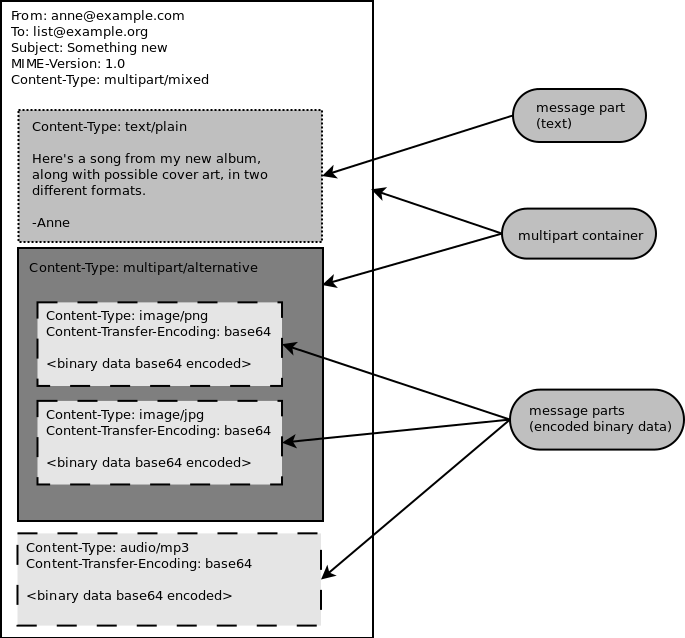
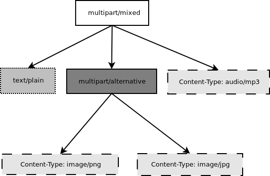
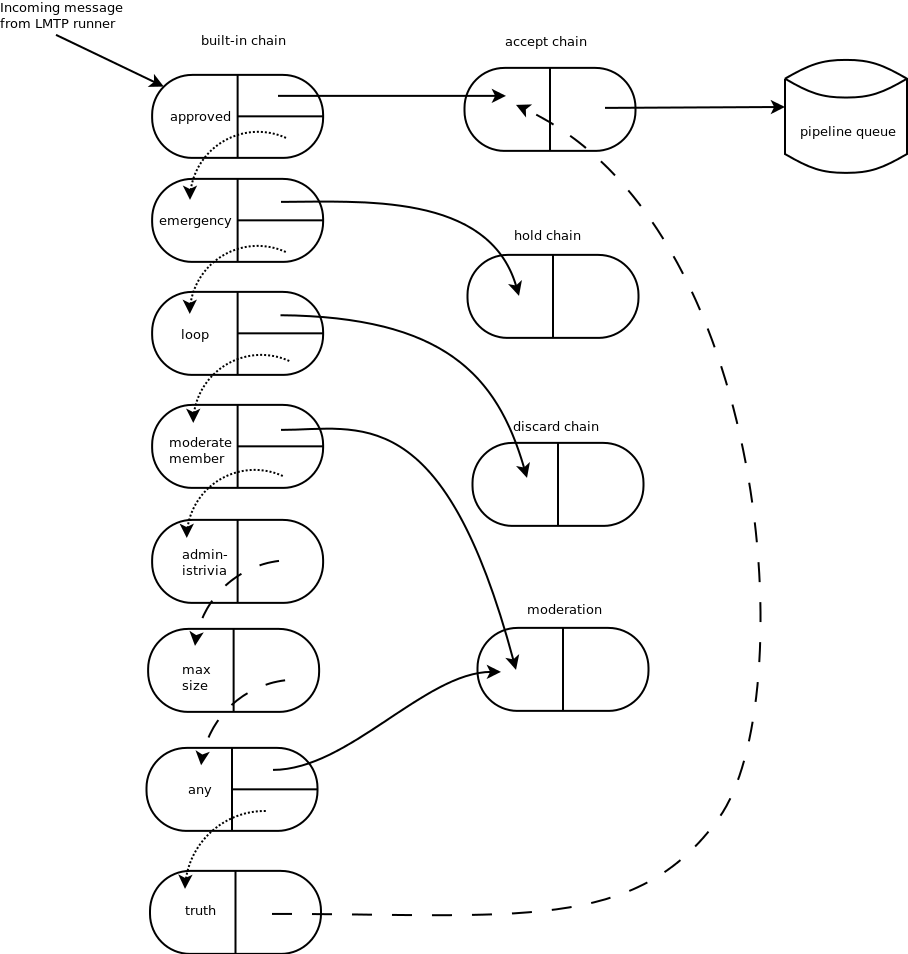
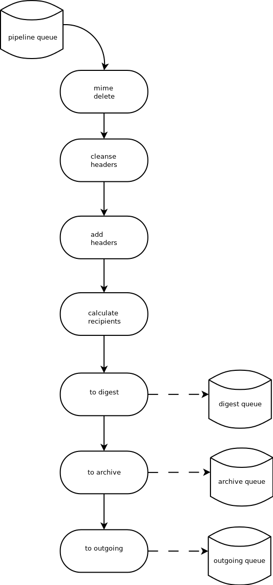

<!-- Meta-commentary: this chapter is very clear to understand on the whole. It is
mostly written in the third person, but this is not perfectly consistent. Sometimes
some first and second person sentences are thrown in there (full of "we"s and "you"s).
I've pointed out many but not all of these sentences in comments. Keeping the person
consistent would do wonders for the readability of this chapter. Other than that,
I only had a few minor comments that I've sprinkled throughout the text.

Very informative chapter overall! -->

A brief history
===============

`GNU Mailman`_ is free software for managing mailing lists.  Almost everybody
who writes or uses free and open source software has probably encountered a
mailing list.  Mailing lists can be discussion-based or announcement-based,
with all kinds of variations in between.  Sometimes mailing lists are
gatewayed to newsgroups on Usenet or `Gmane`_.  Mailing lists typically have
archives which contain the historical record of all the messages that have
been posted to the mailing list.

GNU Mailman has been around since the early '90s, when John Viega wrote the
first version to connect fans with a band he was friends with in college: the
Dave Matthews Band.  By the mid-90's, the center of the Python universe had
moved from `CWI`_ in the Netherlands to `CNRI`_ in Reston Virginia USA, and we
<!-- Who's "we" here? Use third person and also explain the context of this
paragraph; as someone who knows little about the history of Mailman and Python,
these acronyms and historical notes need more explanation if they're to be included. -->
were running its mailing list using Majordomo.  Of course, it just wouldn't do
for the Python world to be running a Perl-based mailing list, and besides, it
was too difficult to make the changes we needed to Majordomo.  Ken Manheimer
was instrumental in resurrecting an early version of Mailman from John's
failed hard drive.  Many excellent developers have contributed to Mailman
since then, and today, Mark Sapiro is maintaining the stable 2.1 branch, while
Barry Warsaw concentrates on the new 3.0 version.

Many of the original architectural decisions John made have lived on in the
code right up until the Mailman 3 branch, and in fact can still be seen in the
stable branch.  In the sections that follow, I touch on how we've addressed
some of the more problematic design decisions in Mailman 3. <!-- Another first
person sentence -->

In the early Mailman 1.x days, we had a lot of problems with messages getting
lost, or bugs causing messages to be re-delivered over and over again.  This
prompted us to articulate two overriding principles that I think were critical
to Mailman's ongoing success:

 * No message should ever get lost
 * No message should ever be delivered twice

In Mailman 2.0 we re-designed the message handling system, to ensure that
these two principles would always be of prime importance.  This part of the
system has been stable for at least a decade now, and is one of the key
reasons that Mailman is as ubiquitous as it is today.  Despite modernizing
this subsystem in Mailman 3, the design and implementation remains largely
unchanged.

The anatomy of a message
========================

One of the core data structures in Mailman is the *email message*.  Many of
the interfaces, functions, and methods in the system take three arguments: the
mailing list object, the message object, and a metadata dictionary that is
used to record and communicate state while a message is processed through the
system.

On the face of it, an email message is a simple object.  It consists of a
number of colon-separated key-value pairs, called the headers, followed by an
empty line which separates the headers from the message body.  This textural
representation should be easy to parse, generate, reason about, and
manipulate, but in fact, it quickly gets quite complicated.  There are
countless RFCs that describe all the variations that can occur, such as
handling complex data types like images, audio, and more.  Email can contain
ASCII English, or just about any language and character set in existence.  The
basic structure of an email message has been borrowed over and over again for
other protocols, such as NNTP and HTTP, yet each is slightly different.  Work
on Mailman has spawned several libraries just to deal with the vagaries of
this format (often called *RFC822* for the founding `1982 IETF standard`_),
and development is ongoing even today to fix and improve the email package in
the Python standard library so that it is more standards-compliant and robust.

Email messages can act as containers for other types of data, as defined in
the various MIME standards.  A container *message part* can encode an image,
some audio, or just about any type of binary or text data.  In mail reader
applications, these are known as *attachments*.  Figure 1 shows the structure
of a complex MIME message.  The blue boxes are the container parts, the yellow
boxes are base 64 encoded binary data, and the red box is a plain text
message.

   Figure 1.  A MIME `multipart/mixed` message containing text, images and an
   audio file.

Container parts can also be arbitrarily nested; these are called *multiparts*
and can in fact get quite deep.  But all email messages regardless of their
complexity can be modeled as a tree, with a single message object at its root.
Within Mailman, we often refer to this as the *message object tree*, and we
pass this tree around by reference to the root message object.  Figure 2 shows
the object tree of the above multipart message.

   Figure 2.  Message object tree of a complex MIME email message.

Mailman will almost always modify the original message in some way.
Sometimes, the transformations can be fairly benign, such as adding or
removing headers.  Sometimes, we'll completely change the structure of this
message object tree, such as when the content filter removes certain content
types like HTML, images, or other non-text parts.  Mailman might even collapse
`multipart/alternatives` (i.e. where a message appears as both plain text and
as some rich text type), or add additional parts containing information about
the mailing list itself.

Mailman generally parses the *on the wire* bytes representation of a message
just once, when it first comes into the system.  From then on, it deals only
with the message object tree until it's ready to send it back out to the
outgoing mail server.  It's at that point that Mailman flattens the tree back
into a bytes representation.  Along the way, Mailman `pickles`_ the message
object tree for quick storage to, and reconstruction from, the file system.
*Pickles* are a Python technology for serializing any Python object to a byte
stream, including all its subobjects, and it's perfectly suited to optimizing
the handling of email message object trees. *Unpickling* is deserializing this
byte stream back into a live object.  By storing these byte streams in a file,
Python programs gain low cost persistence.

The mailing list
================

The *mailing list* is obviously another core object in the Mailman system, and
most of the operations in Mailman are mailing list-centric, such as:

 * Membership is defined in terms of a user or address being subscribed to a
   specific mailing list.
 * Mailing lists have a large number of configuration options that are stored
   in the database, and which control everything from posting privileges, to
   how the message is modified before final delivery.
 * Mailing lists have owners and moderators which have greater permission to
   change aspects of the list, or to approve and reject questionable
   postings.
 * Every mailing list has its own archive.
 * Users post new messages to a specific mailing list.

and so on.  Almost every operation in Mailman takes a mailing list as an
argument - it's that fundamental.  Mailing list objects have undergone a
radical redesign in Mailman 3 to make them more efficient and to expand their
flexibility.

One of John's earliest design decisions was how to represent a mailing list
object inside the system.  For this central data type, he chose a Python class
with multiple base classes, each of which implements a small part of the
mailing list's responsibility.  These cooperating base classes, called *mixin
classes* were a clever way to organize the code so that it was easy to add
entirely new functionality.  By grafting on a new mixin base class, the core
``MailList`` class could easily accommodate something new and cool.

For example, to add an auto-responder to Mailman 2, a mixin class was created
that held the data specific to that feature, which would get automatically
initialized when a new mailing list was created.  The mixin class also
provided the methods necessary to support the auto-responder feature.

This structure was even more useful when it came to the question of
persistence.  *Persistence* is the storage and retrieval of program state in
order to preserve it between stops and starts.  Another of John's early design
decisions was to use Python pickles for storing``MailList`` state persistence.

In Mailman 2, the ``MailList`` object's state is stored in a file called
``config.pck``, which is just the pickled representation of the ``MailList``
object's dictionary.  Every Python object has an attribute dictionary called
``__dict__``.  Saving a mailing list object then was just a matter of pickling
its ``__dict__`` to a file, and loading it just involved reading the pickle
from the file and reconstituting its ``__dict__``.

Thus, when a new mixin class was added to implement some new functionality,
all the attributes of the mixin were automatically pickled and unpickled
appropriately.  The only extra work we had to do was to maintain a *schema
version number* to automatically upgrade older mailing list objects when new
attributes were added via the mixin, since the pickled representation of older
``MailList`` objects would be missing the new attributes.

As convenient as this was, both the mixin architecture and pickle persistence
eventually crumbled under their own weight.  Site administrators often
requested ways to access the mailing list configuration variables via
external, non-Python systems.  But the pickle protocol is entirely
Python-specific, so sequestering all that useful data inside a pickle wouldn't
work for them.  Also, because the entire state of a mailing list was contained
in the ``config.pck``, and Mailman has multiple processes that need to read,
modify, and write the mailing list state, we had to implement exclusive
file-based and NFS-safe locks to ensure data consistency.  Every time some
part of Mailman wants to change the state of a mailing list, it must acquire
the lock, write out the change, then release the lock.  This serialization of
operations on a mailing list turned out to be horribly slow and inefficient.

For these reasons, Mailman 3 stores all of its data in a SQL database.  By
default SQLite3 is used, though this is easily changed, since Mailman 3
utilizes the Object Relational Mapper called Storm, which supports a wide
variety of databases.  PostgreSQL support was added with just a few lines of
code, and a site administrator can enable it by changing one configuration
variable.

Another, bigger problem is that in Mailman 2, each mailing list is a silo.
Often operations span across many mailing lists, or even all of them.  For
example, a user might want to temporarily suspend all their subscriptions when
they go on vacation.  Or a site administrator might want to add some
disclaimer to the welcome message of all of the mailing lists on her system.
Even the simple matter of figuring out which mailing lists a single address
was subscribed to required unpickling the state of every mailing list on the
system, since membership information was kept in the ``config.pck`` file too.

Another problem was that each ``config.pck`` file lived in a directory named
after the mailing list, but Mailman was originally designed without
consideration for virtual domains.  This lead to a very unfortunate problem
where two mailing lists could not have the same name in different domains.
For example, if you owned both the ``example.com`` and ``example.org``
domains, and you wanted them to act independently and allow for a different
``support`` mailing list in each, you cannot do this in Mailman 2, without
modifications to the code, a barely-supported hook, or conventional
workarounds that forced a different list name under the covers (such as what
SourceForge does).
<!-- Why do we need to bring the reader into this example? It would work just
as well to say "For example, if Sally owned both example.com and example.org
domains and wanted to have independent 'support' mailing lists for each, she
could not easily do this with Mailman 2."

I find the example unnecessary anyway. The sentence stating that two lists
cannot have the same name in different domains is easy enough to understand
without the use of an illustrating example. -->

This has been solved in Mailman 3 by changing the way mailing lists are
identified, along with moving all the data into a traditional database.  The
*primary key* for the mailing list table is the *fully qualified list name* or
as you'd probably recognize it, the posting address.  Thus
``support@example.com`` and ``support@example.org`` are now completely
independent rows in the mailing list table, and can easily co-exist in a
single Mailman system.
<!-- The "as you'd probably recognize it" clause is distracting here. Just
say "*fully qualified list name*, commonly known as the posting address" or
something similar. -->

Runners
=======

Messages flow through the system by way of a set of independent processes
called *runners*.  Originally conceived as a way of predictably processing all
the files found in a particular directory, there are now a few runners which
don't process files in a directory but instead are simply independent
processes that perform a specific task and are managed by a master process.
More on that later.  When a runner does manage the files in a directory, it is
called a *queue runner*.

Mailman is religiously <!--Really? What does it mean for a process to be
religious? --> single threaded, even though there is significant
parallelism to exploit.  For example, Mailman can accept messages from the
mail server at the same time it's sending messages out to recipients, or
processing bounces, or archiving a message.  Parallelism in Mailman is
achieved through the use of multiple processes, in the form of these runners.
For example, there is an *incoming* queue runner with the sole job of
accepting (or rejecting) messages from the upstream mail server.  There is an
outgoing queue runner with the sole job of communicating with the upstream
mail server over SMTP in order to send messages out to the final recipients.
There's an archiver queue runner, a bounce processing queue runner, a queue
runner for forwarding messages to an NNTP server, a runner for composing
digests, and several others.  Runners which don't manage a queue include an
LMTP server and a REST HTTP server.

<!-- This paragraph seems to fit better right above the paragraph about the
SHA1-based file naming algorithm. The stuff in between is less related -->
Each queue runner is responsible for a single directory, i.e. its *queue*.
While the typical Mailman system can perform perfectly well with a single
process per queue, <!-- Use third person - Mailman uses a clever... -->
we use a clever algorithm for allowing parallelism within a
single queue directory, without requiring any kind of cooperation or locking.
The secret is in the way <!-- Mailman names --> we name the files within
the queue directory.

As mentioned above, every message that flows through the system is also
accompanied by a metadata dictionary that accumulates state and allows
independent components of Mailman to communicate with each other.  Python's
pickle library is able to serialize and deserialize multiple objects to a
single file, <!-- use third person - the tree and dictionary can both be 
pickled into one file --> so we can pickle both the message object tree 
and metadata dictionary into one file.

There is a core Mailman class called ``Switchboard`` which provides an
interface for enqueuing (i.e. writing) and dequeuing (i.e. reading) the
message object tree and metadata dictionary to files in a specific queue
directory.  Every queue directory has at least one switchboard instance, and
every queue runner instance has exactly one switchboard.

Pickle files all end in the ``.pck`` suffix, though <!-- use third person -
.bak, .tmp, etc. may all appear in a queue --> you may also see ``.bak``,
``.tmp``, and ``.psv`` files in a queue.  These are used to ensure one of the
two sacrosanct tenets of Mailman: no file should ever get lost, and no message
should ever be delivered twice.  But things usually work properly and these
files can be pretty rare.

For really busy sites, Mailman supports running more than one runner process
per queue directory, completely in parallel, with no communication between
them or locking necessary to process the files.  It does this by naming the
pickle files with a SHA1 hash, and then allowing a single queue runner to
manage just a slice of the hash space.  So if a site wants to run two runners
on the ``bounces`` queue, one would process files from the top half of the
hash space, and the other would process files from the bottom half of the hash
space.  The hashes are calculated using the contents of the pickled message
object tree, plus the name of the mailing list that the message is destined
for, plus a time stamp.  This makes the SHA1 hash effectively random, and thus
on average a two-runner queue directory will have about equal amounts of work
per process.  And because the hash space can be statically divided, these
processes can operate on the same queue directory with no interference or
communication necessary.

There's an interesting limitation to this algorithm: the number of runners per
queue directory must be a power of 2.  This means there can be 1, 2, 4, or 8
runner processes per queue, but not for example, 5.  In practice this has
never been a problem, since few sites will ever need more than 4 processes to
handle their load. <!-- This doesn't make sense. There's no mathematical
reason why the hash space can't be partitioned into fifths, or any other
arbitrary number of parts. "if (hash_code % total_runners == id_for_this_runner)" 
should do it. -->

There's another side effect of this algorithm that did cause problems during
the early design of this system.  Despite the unpredictability of email
delivery in general, the best user experience is provided by processing the
queue files in FIFO order, so that replies to a mailing list get sent out in
roughly chronological order.  Not making a best effort attempt at doing so can
cause confusion for members.  But using SHA1 hashes as file names obliterates
any timestamps, and for performance reasons ``stat(2)`` calls on queue files,
or unpickling the contents (e.g. to read a time stamp in the metadata) should
be avoided.

Mailman's solution to this was to extend the file naming algorithm to include
a time stamp prefix, as the number of seconds since the epoch, e.g.
``<timestamp>+<sha1hash>.pck``.  Thus each loop through the queue runner only
needs to do an ``os.listdir()`` to get all the files waiting to be processed,
then split the file name and ignore any where the SHA1 hash doesn't match its
slice of responsibility, then sort the files based on the timestamp part of
the file name.

In practice this has worked extremely well for at least a decade, with only
the occasional minor bug fix or elaboration to handle obscure corner cases and
failure modes.  It's one of the most stable parts of Mailman and was largely
ported untouched from Mailman 2 to Mailman 3.

The master runner
=================

With all these runner processes, Mailman needed a simple way to start and stop
them consistently.  Thus the master runner process was born, and it must be
able to handle both queue runners, and runners which do not manage a queue.
For example, in Mailman 3, we accept messages from the incoming upstream mail
server via LMTP, which is a protocol similar to SMTP, but which operates only
for local delivery and thus can be much simpler, as it doesn't need to deal
with the vagaries of delivering mail over an unpredictable internet.  The LMTP
runner simply listens on a port, waiting for its upstream mail server to
connect and send it a byte stream.  It then parses this byte stream into a
message object tree, creates an initial metadata dictionary and enqueues this
into a processing queue directory.

Mailman also has a runner that listens on another port and processes REST
requests over HTTP.  This process doesn't handle queue files at all.

A typical running Mailman system might have 8 or 10 processes, and they all
need to be stopped and started appropriately and conveniently.  They can also
crash occasionally, for example when a bug in Mailman causes an exception to
occur that isn't caught.  In cases like this, the master will restart the
runner process, and because of the "never lose a message" and "never deliver a
message twice" mantras, it will generally just pick up where it left off.

When the master watcher starts, it looks in a configuration file to determine
how many and which types of child runners to start.  For the LMTP and REST
runners, there is usually exactly one such process.  For the queue runners, as
mentioned above, there can be a power-of-2 number of parallel processes.  The
master forks and execs all the runner processes based on the configuration
file, passing in the appropriate command line arguments for each (e.g. to tell
the subprocess which slice of the hash space to look at).  Then the master
basically sits in an infinite loop, blocking until one of its child processes
exits.  It keeps track of the process ID for each child, along with a count of
the number of times the child has been restarted.  This latter is to prevent a
catastrophic bug from causing a cascade of unstoppable restarts.  There's a
configuration variable which specifies how many restarts are allowed, after
which an error is logged and the runner is not restarted.

When a child does exit, the master looks at both the exit code and the signal
that killed the subprocess.  Each runner process installs a number of signal
handlers with the following semantics:

 * SIGTERM - intentionally stop the subprocess.  It is not restarted.  SIGTERM
   is what ``init`` will kill the process with when changing run levels, and
   it's also the signal that Mailman itself uses to stop the subprocess.
 * SIGINT - also used to intentionally stop the subprocess, it's the signal
   that occurs when *control-C* is used in a shell.  The runner is not
   restarted.
 * SIGHUP - tells the process to close and reopen its log files, but to keep
   running.  This is used when rotating log files.
 * SIGUSR1 - initially stop the subprocess, but allow the master to restart
   the process.  This is used in the ``restart`` command of init scripts.

The master also installs handlers for all four of these signals, but it
doesn't do much more than forward them to all its subprocesses.  So if you
sent SIGTERM to the master, all the subprocesses would get SIGTERM'd and
exit.  The master would know that the subprocess exited because of SIGTERM and
it would know that this was an intentional stoppage, so it would not restart
the runner.

The master installs one other signal handler, on SIGALRM.  It does this
because the master acquires a file lock with a lifetime of about a day and a
half, to ensure that only one master is running at any one time.  Multiple
masters would really screw things up!  Just to be safe though, the master
wakes up about once a day and refreshes this file lock.  So the lock should
never time out or be broken while Mailman is running, unless of course the
system crashes, or the master is killed with an uncatchable signal.  In those
cases, the command line interface to the master process provides an option to
override a stale lock.

This leads to the last bit of the master watcher story, the command line
interface to it.  The actual master script takes very few command line
options.  Both it and the queue runner scripts are intentionally kept simple.
This wasn't the case in Mailman 2, where the master script was fairly complex
and tried to do too much, which made it more difficult to understand and
debug.  In Mailman 3, the real command line interface for the master process
is in the ``bin/mailman`` script, a kind of meta-script that contains a number
of subcommands, in a style made popular by programs like Subversion.  This
reduces the number of programs that need to be installed on your shell's
``PATH``.  ``bin/mailman`` has subcommands to start, stop, and restart the
master, as well as all the subprocesses, and also to cause all the log files
to be reopened.  The ``start`` subcommand forks and execs the master process,
while the others simply send the appropriate signal to the master, which then
propagates it to its subprocesses as described above.

This improved separation of responsibility make it much easier to understand
each individual piece.

Rules, links, and chains
========================

A mailing list posting goes through several phases from the time it's first
received, until the time it's sent out to the list's membership.  In Mailman
2, each processing step was represented by a *handler*, and a string of
handlers were put together into a *pipeline*.  So, when a message came into
the system, Mailman would first determine which pipeline would be used to
process it, and then each handler in the pipeline would be called in turn.
Some handlers would do moderation functions (e.g. "is this person allowed to
post to the mailing list?"), others would do modification functions
(e.g. "which headers should I remove and add?"), and others would copy the
message to other queues.  A few examples of the latter are:

 * A message accepted for posting would be copied to the *archiver* queue at
   some point, so that its queue runner would add the message to the archive.
 * A copy of the message eventually had to end up in the *outgoing* queue so
   that it could be delivered to the upstream mail server, which has the
   ultimate responsibility of delivery to a list member.
 * A copy of the message had to get put into a digest for people who wanted
   only occasional, regular traffic from the list, rather than an individual
   message whenever someone sent it.

The pipeline-of-handlers architecture proved to be quite powerful.  It
provided an easy way that people could extend and modify Mailman to do custom
operations.  The interface for a handler was fairly straightforward, and it
was a simple matter to implement a new handler, ensuring it got added to the
right pipeline in the right location to accomplish the custom operation.

One problem with this though was that mixing moderation and modification in
the same pipeline became problematic.  The handlers had to be sequenced in the
pipeline just so, or unpredictable or undesirable things would happen.
Sometimes it was desirable to moderate the message without modifying it, or
vice versa.  In Mailman 3, these two operations have been split into separate
subsystems.

As described previously, the LMTP runner parses an incoming byte stream into a
message object tree and creates an initial metadata dictionary for the
message.  It then enqueues these to one or another queue directory.  Some
messages may be *email commands* (e.g. to join or leave a mailing list, to get
automated help, etc.)  which are handled by a separate queue.  Most messages
are postings to the mailing list, and these get put in the *incoming* queue.
The incoming queue runner processes each message sequentially through a
*chain* consisting of any number of *links*.  There is a built-in chain that
most mailing lists use, but even this is configurable.

Figure 3 illustrates the default set of chains in the Mailman system.  Each
link in the chain is illustrated by a rounded rectangle.  The built-in chain
is where the initial rules of moderation are applied to the incoming message,
and in this chain, each link is associated with a *rule*.  Rules are simply
pieces of code that get passed the three typical parameters: the mailing list,
the message object tree, and the metadata dictionary.  Rules are not supposed
to modify the message; they just make a binary decision and return a boolean
answering the question "did the rule match or not?".  Rules can also record
information in the metadata dictionary.

In the figure, green arrows indicates message flow when the rule matches,
while red arrows indicate message flow when the rule does not match.  The
outcome of each rule is recorded in the metadata dictionary so that later on,
Mailman will know (and be able to report) exactly which rules matched and
which ones missed.

   Figure 3.  Simplified view of default chains with their links.

It's important to note that the rules themselves do not dispatch based on
outcome.  In the built-in chain, each link is associated with an *action*
which is performed when the rule matches.  So for example, when the "loop"
rule matches (meaning, the mailing list has seen this message before), the
message is immediate handed off to the "discard" chain, which throws the
message away after some bookkeeping.  If the "loop" rule does not match, the
next link in the chain will process the message.

In the figure, the links associated with "administrivia", "max-size", and
"truth" rules have no binary decision.  In case of the first two, this is
because their action is *deferred*, so they simply record the match outcome
and processing continues to the next link.  The "any" rule then matches if any
previous rule matches.  This way, Mailman can report on all the reasons why a
message is not allowed to be posted, instead of just the first reason.  There
are several more such rules not illustrated here for simplicity.

The "truth" rule is a bit different.  It's always associated with the last
link in the chain, and it always matches.  With the combination of the
penultimate "any" rule sweeping aside all previously matching messages, the
last link then knows that any message making it through thus far is allowed to
be posted to the mailing list, so it unconditionally moves the message to the
"accept" chain.

There are a few other details of chain processing not described here, but the
architecture is very flexible and extensible so that just about any type of
message processing can be implemented, and sites can customize and extend
rules, links, and chains.

What happens to the message when it hits the "accept" chain?  The message,
which is now deemed appropriate for the mailing list, is sent off to the
*pipeline* queue for some modifications before it is delivered to the end
recipients.  This process is described in more detail in the following
section.

The "hold" chain puts the message into a special bucket for the human
moderator to review.  The "moderation" chain does a little additional
processing to decide whether the message should be accepted, held for
moderator approval, discarded, or rejected.  Not illustrated is the "reject"
chain, which is used to bounce messages back to the original sender.

Handlers and pipelines
======================

Once a message as made its way through the chains and rules, and a message is
accepted for posting, the message must be further processed before it can be
delivered to the final recipients.  For example, some headers may get added or
deleted, and some messages may get some extra decorations that provide
important disclaimers or information, such as how to leave the mailing list.
These modifications are performed by a *pipeline* which contains a sequence of
*handlers*.  In a manner similar to chains and rules, pipelines and handlers
are extensible, but there are a number of built-in pipelines for the common
cases.  Handlers have a similar interface as rules, accepting a mailing list,
message object, and metadata dictionary.  However unlike rules, handlers can
and do modify the message.

Figure 4 illustrates the default pipeline and set of handlers (some handlers
are omitted for simplicity).

   Figure 4.  Pipeline queue handlers.

For example, a posted message needs to have a ``Precedence:`` header added
which tells other automated software that this message came from a mailing
list.  This header is a defacto standard to prevent vacation programs from
responding back to the mailing list.  Adding this header (among other header
modifications) is done by the "add headers" handler.  Unlike with rules,
handler order generally doesn't matter, and messages always flow through all
handlers in the pipeline.

Some handlers send copies of the message to other queues.  As shown in the
figure, there is a handler that makes a copy of the message for folks who want
to receive digests.  Copies are also sent to the archive queue for eventual
delivery to the mailing list archives.  Finally, the message is copied to the
outgoing queue for final delivery to the mailing list's members.

VERP
====

*VERP* stands for *Variable Envelope Return Path*, and it is a `well-known
technique`_ that mailing lists can use to unambiguously determine bouncing
recipient addresses.  When an address on a mailing list is no longer active,
the recipient's mail server will send a notification back to the sender.  In
the case of a mailing list, you want this bounce to go back to the mailing
list, not to the original author of the message.  The author can't do anything
about the bounce, and worse, sending the bounce back to the author can leak
information about who is subscribed to the mailing list.  When the mailing
list gets the bounce, it can do something useful, such as disable the bouncing
address or remove it from the list's membership.

There are two general problems with this.  First, even though there is a
standard format for `these bounces`_ (called *delivery status notifications*)
many mail servers out there do not conform to it.  Instead, the body of their
bounce messages can contain just about any amount of
difficult-to-machine-parse gobbledygook, which makes automated parsing
difficult.  In fact, Mailman uses a library that contains dozens of bounce
format heuristics, all of which have been seen in the wild during the 15 years
of Mailman's existence.

Second, imagine the situation where a member of a mailing list has several
forwards.  She might be subscribed to the list with her anne@example.com
address, but this might forward to person@example.org which might further
forward the message to me@example.net.  When the server at example.net gets
the message at the final destination, it will usually just send a bounce
saying that me@example.net is no longer valid.  But the Mailman server that
sent the message only knows the member as anne@example.com, so the bounce
flagging me@example.net will not contain a subscribed address, and Mailman
will ignore it.

Along comes VERP, which exploits a requirement of the fundamental `SMTP
protocol`_ to provide unambiguous bounce detection, by returning such bounce
messages to the *envelope sender*.  This is not the ``From:`` field in the
message body, but in fact the ``MAIL FROM`` value set during the SMTP dialog.
This is preserved along the delivery route, and the ultimate receiving mail
server is required by the standards to send the bounces to this address.
Mailman uses this fact to encode the original recipient email address into the
``MAIL FROM`` value.

If the recipient is anne@example.com and the Mailman server is
mylist@example.org, then the VERP'd envelope sender for a mailing list posting
sent to anne@example.com will be
``mylist-bounce+anne=example.com@example.org``.  The ``+`` here is a local
address separator, which is a format supported by most modern mail servers.
So when the bounce comes back, it will actually get delivered to
``mylist-bounce@example.com`` but with the ``To:`` header still set to VERP'd
encoded recipient address.  Mailman can then parse this ``To:`` header to
decode the original recipient, e.g. anne@example.com.

While VERP is an extremely powerful tool for culling bad addresses from the
mailing list, it does have one potentially important disadvantage.  Using VERP
requires that Mailman send out exactly one copy of the message per recipient.
Without VERP, Mailman can bundle up identical copies of an outgoing message
for multiple recipients, thus reducing overall bandwidth and processing time.
But VERP requires a unique ``MAIL FROM`` for each recipient, and the only way
to do that is to send a unique copy of the message.  Generally this is an
acceptable trade-off, and in fact, once these individualized messages are
being sent for VERP anyway, there are a lot of useful things Mailman can also
do.  For example, it can embed a URL in the footer of the message customized
for each recipient which gives them a direct link to unsubscribe from the
list.  You could even imagine various types of *mail-merge* operations for
customizing the body of the message for each individual recipient.

REST
====

One of the key architectural changes in Mailman 3 addresses a common request
over the years: allow Mailman to be more easily integrated with external
systems.  When I was hired by Canonical in 2007, my job was originally to add
mailing lists to Launchpad.  I knew that Mailman 2 could do the job, but there
was a requirement to use Launchpad's web user interface instead of Mailman's
default user interface.  Since Launchpad mailing lists were almost always
going to be discussion lists, we wanted very little variability in the way
they operated.  List administrators would not need the plethora of options
available in the typical Mailman site, and what few options they would need
would be exposed through the Launchpad web ui.

At the time, Launchpad was not open source (this changed in 2009), so we had
to design the integration in such a way that Mailman 2's GPLv2 code could not
infect Launchpad.  This led to a number of architectural decision during that
integration design that were quite tricky and somewhat inefficient.  Because
Launchpad is now open source, these hacks wouldn't be necessary today, but
having to do it this way did provide some very valuable lessons on how a web
ui-less Mailman could be integrated with external systems.  The vision that
emerged was of a core engine that implemented mailing list operations
efficiently and reliably, and that could be managed by any kind of web
front-end, including ones written in Zope, Django, even non-Python frameworks
such as PHP, or with no web ui at all.

There were a number of technologies at the time that would allow this, and in
fact Mailman's integration with Launchpad is based on XMLRPC.  But XMLRPC has
a number of problems that make it a less than ideal protocol.

Mailman 3 has adopted the `Representation State Transfer`_ (REST) model for
external administrative control.  REST is based on HTTP, and Mailman's default
object representation is `JSON`_.  These protocols are ubiquitous and
well-supported in a large variety of programming languages and environments,
making it fairly easy to integrate Mailman with third party systems.  REST was
the perfect fit for Mailman 3, and now much of its functionality is exposed
through a REST API.

This is a powerful paradigm that more applications should adopt: deliver a
core engine that implements its basic functionality well, exposing a REST API
to query and control it.  This architecture is extremely flexible and can be
used and integrated in ways that are beyond the initial vision of the system
designers.  The REST API provides yet another way of integrating with Mailman,
the others being utilizing the command line interface, and writing Python code
to access the internal API.

Not only does this design allow for much greater choices for deployment, even
the official components of the system can be designed and implemented
independently.  For example, the new official web ui for Mailman 3 is
technically a separate project with its own code base, driven primarily by
experienced web designers.  These outstanding developers are empowered to make
decisions, create designs, and execute implementations without the core engine
development being a bottleneck.  The web ui work feeds back into the core
engine implementation by requesting additional functionality, exposed through
the REST API, but they needn't wait for it, since they can mock up the server
side on their end and continue experimenting and developing the web ui.  Once
the core engine catches up, they can hook it all together and watch it work
for real.

We plan to use the REST API for many more things, including allowing the
scripting of common operations, and even integration with IMAP or NNTP servers
for alternative access to the archives.

Internationalization
====================

GNU Mailman was one of the first Python programs to embrace
internationalization.  Of course, because Mailman does not usually modify the
contents of email messages posted through it, those messages can be in any
language of the original author's choosing.  However, when interacting
directly with Mailman, either through the web interface, or via email
commands, users would prefer to use their own natural language.

Mailman pioneered many of the technologies used in the Python world to
internationalize applications, but it is actually much more complex than most
applications.  In a typical desktop environment, the natural language is
chosen when the user logs in, and remains static throughout the desktop
session.  Mailman however is a server application, so it must be able to
handle dozens of languages, separate from the language of the system on which
it runs.  In fact, Mailman must somehow determine the *language context* that
a response is to be returned under, and translate its text to that language.
Sometimes a response may even involve multiple language, for example if a
bounce message from a Japanese user is to be forwarded to list administrators
who speak German, Italian, and Catalan.

Again, Mailman pioneered some key Python technologies to handle complex
language contexts such as these.  It utilizes a library that manages a stack
of languages, which can be pushed onto and popped from as the context changes,
even within the processing of a single message.  It also implements an
elaborate scheme for customizing its response templates based on site
preferences, list owner preferences, and language choice.

Lessons
=======

While this article has provided an overview of Mailman 3's architecture, and
insight into how that architecture has evolved over the 15 years of its
existence (through three major rewrites), there are lots of other interesting
architectural decisions in Mailman which I can't cover.  These include the
configuration subsystem, the testing infrastructure, the database layer, the
use of interfaces, archiving, mailing list styles, the email commands and
command line interface, and integration with the outgoing mail server.
Contact us on the developers mailing list if you're interested in more detail.

To wrap up, here are some lessons I've learned while rewriting a popular,
established, and stable piece of the open source ecosystem.

* Use test driven development (TDD).  There really is no other way!  Mailman 2
  largely lacks an automated test suite, and while it's true that not all of
  the Mailman 3 code base is covered by its test suite, most of it is, and all
  new code is required to be accompanied by tests, using either unittests or
  doctests.  Doing TDD is the only way to gain the confidence that the changes
  you make today do not introduce regressions in existing code.  Yes, TDD can
  sometimes take longer, but think of it as an investment in the future
  quality of your code.  In that way, *not* having a good test suite means
  you're just wasting your time.  Remember the mantra: untested code is broken
  code.

* Get your bytes/strings story straight from the beginning.  In Python 3, a
  sharp distinction is made between unicode text strings and byte arrays,
  which, while initially painful, is a huge benefit to writing correct code.
  Python 2 blurred this line by having unicodes and 8-bit strings, with some
  automated coercions between them.  While appearing to be a useful
  convenience, problems with this fuzzy line is the number one cause of bugs
  in Mailman 2.  This is not helped by the fact that email is notoriously
  difficult to classify between strings and bytes.  Technically, the
  on-the-wire representation of an email is as a sequence of bytes, but these
  bytes are almost always ASCII, and there is a strong temptation to
  manipulate message components as text.  The email standards themselves
  describe how human readable, non-ASCII text can be safely encoded, so even
  things like finding a ``Re:`` prefix in a ``Subject:`` header will be text
  operations, not byte operations.  Mailman's principle is to convert all text
  to unicode as early as possible, deal with the text as unicode internally,
  and only convert it back to bytes on the way out.  It's critical to be
  crystal clear from the start when you're dealing with bytes and when you're
  dealing with text (unicode), since it's very difficult to retrofit this
  fundamental model shift later.

* Internationalize your application from the start.  Do you want your
  application to only be used by the minority of the world that speaks
  English?  Think about how many fantastic users this ignores!  It's not hard
  to set up internationalization, and there are lots of good tools for making
  this easy, many of which were pioneered in Mailman.  Don't worry about the
  translations to start with, if your application is accessible to the world's
  wealth of languages, you will have volunteer translators knocking down your
  door to help.

GNU Mailman is a vibrant project with a healthy user base, and lots
of opportunities for contributions.  Here are some resources you can use if
you think you'd like to help us out, which I hope you do!

Primary web site        : http://www.list.org
Project wiki            : http://wiki.list.org
Developer mailing list  : mailman-developers@python.org
Users mailing list      : mailman-users@python.org
Freenode IRC channel    : #mailman

.. _`GNU Mailman`: http://www.list.org
.. _`Gmane`: http://gmane.org/
.. _`CWI`: http://www.cwi.nl/
.. _`CNRI`: http://www.cnri.reston.va.us/
.. _`1982 IETF standard`: http://www.faqs.org/rfcs/rfc822.html
.. _`pickles`: http://docs.python.org/library/pickle.html
.. _`well-known technique`: http://cr.yp.to/proto/verp.txt
.. _`these bounces`: http://www.faqs.org/rfcs/rfc5337.html
.. _`SMTP protocol`: http://www.faqs.org/rfcs/rfc5321.html
.. _`Representational State Transfer`:
   http://en.wikipedia.org/wiki/Representational_state_transfer
.. _`JSON`: http://en.wikipedia.org/wiki/Json
